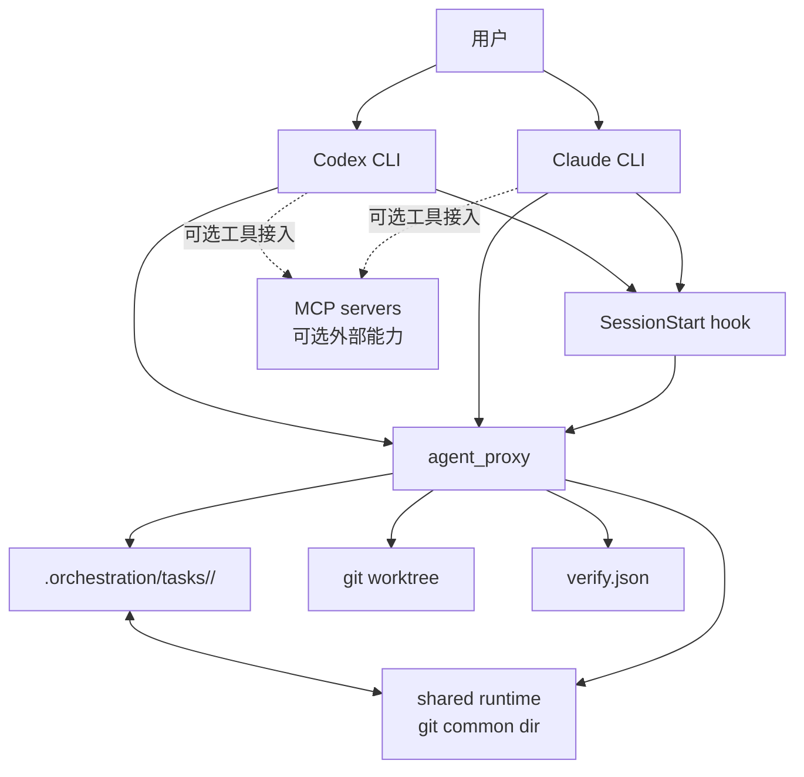
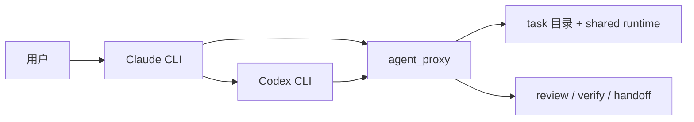
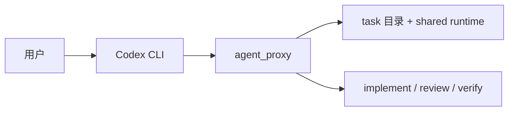

# Shared Control Plane Model

这份说明描述这个项目采用的控制面模型。

核心入口是 `.orchestration/`。Claude 和 Codex 读取同一份规范、同一份任务契约、同一套 phase 定义。工具目录只保留 adapter，不再自己维护任务真源。

## 分层

当前分层是：

- `.orchestration/specs/`：共享规范真源
- `.orchestration/tasks/<task-id>/`：任务契约、checkpoint、handoff、verify
- `memory/current/`：当前共享工作集，只放短摘要和恢复入口
- `memory/history/`：退出当前工作集后的旧摘要
- `docs/`：正式文档，`docs/todo/` 放待办，`docs/archive/` 放归档
- `.claude/`、`.codex/`、`.agents/`：工具侧 adapter 和入口，不保存共享任务状态

## 任务状态放哪里

repo 内只保存低频、可审查、需要进版本控制的部分：

- `contract.json`：phase graph、phase inputs、worktree policy、verify 引用
- `task.md`：给人读的任务说明
- `context/<phase>.jsonl`：各 phase 的上下文材料
- `verify.json`：verify phase 的命令和通过条件
- `checkpoints/`：低频快照
- `handoffs/`：明确切换时的交接记录

高频运行态不放 repo 工作树，而是放在同一个 `git common dir` 下的 shared runtime。约定路径是：

- `$(git rev-parse --git-common-dir)/<repo-name>/runtime/<task-id>.json`
- `$(git rev-parse --git-common-dir)/<repo-name>/attachments/<task-id>/<run-id>.json`
- `$(git rev-parse --git-common-dir)/<repo-name>/logs/<task-id>/...`

这样做的结果是：同一个 clone family 内可以共享运行态，但不会把短周期状态污染到 Git 历史里。

## 两种控制模式

控制面区分两种模式：

- `claude_codex`
  - Claude 负责 driver、审查和交接
  - 代码实现可以委托给 Claude 会话里的 Codex
  - 任务状态仍然写进 `.orchestration/tasks/` 和 shared runtime，不写进 `.claude/`
- `codex_native`
  - Codex 自己负责 driver 和实现
  - 仍然读取同一套 task contract、verify 和 shared spec

重点不是换谁当主控，而是两边都不能各自发明第二套状态文件。

## 当前运行链路

当前主链路不是 MCP。MCP 只适合接外部能力，不负责 Claude 和 Codex 之间的 phase 协调、handoff 或任务状态同步。

这张图里最重要的是三点：

- CLI 是执行入口，不是状态真源
- `agent_proxy` 是控制动作入口，不是 MCP server
- 任务共享状态只在 task 目录和 shared runtime 里落盘

### `claude_codex` 模式

这个模式里，Claude 是 driver。Codex 可以承担实现，但 phase、handoff、verify 的 authoritative 落盘还是回到共享控制面。

### `codex_native` 模式

这个模式里，Codex 同时承担 driver 和实现。共享契约、verify 规则和运行态位置都不变。

## Adapter 边界

当前保留两份 Codex adapter：

- `.orchestration/codex/`：真源
- `.codex/`：镜像副本，也是当前 runtime 兼容入口

原因是普通环境 clone 下来就能直接用 `.codex/`，但可审查的真源仍然放在 repo 内稳定位置。

当前还有两个约束：

- 这个工作区里的 agent shell 可能把 `.codex/` 看成不可写占位点
- 所以改 Codex adapter 时，先改 `.orchestration/codex/`，再按需要同步到 `.codex/`

项目级 skill 入口也按同样规则处理：

- 真源只写 `.orchestration/codex/skills/`
- `.codex/skills/<name>` 和 `.agents/skills/<name>` 只做入口
- 优先用软链接指向真源
- 需要镜像时，用 `python -m scripts.materialize_codex_adapter --target .codex`

## 文档和 memory 边界

- `docs/` 放正式说明和研究结果
- `docs/todo/` 放未收敛的待办和 WIP
- `docs/archive/` 放被替代的旧材料
- `memory/current/` 只保留短摘要、导航、恢复入口
- `memory/history/` 放失去当前性的旧摘要
- 本机临时操作记忆放 `$(git rev-parse --git-common-dir)/<repo-name>/memory/`
- 任务状态不能写进 `memory/`
- `.claude/` 不再承载项目共享记忆

## CLI 入口

控制动作主要通过 `python -m scripts.agent_proxy` 驱动。已经覆盖：

- backend 切换
- 建任务
- phase 运行
- handoff
- legacy task 迁移
- worktree 和 attachment 管理
- analysis 相关逻辑不在这个仓库里，控制面本身保持项目无关

这意味着控制动作不依赖某个单一会话里的 prompt 约定，而是有明确 CLI 和落盘位置。

## 设计要点

这套控制面最重要的是这几件事：

1. 不再把 Claude 会话当唯一真源，增加共享任务目录和 shared runtime。
2. 把 `.claude/` 和 `.codex/` 降成 adapter，任务状态移到共享层。
3. 明确 `plan / implement / review / verify` 是显式 phase，不靠会话约定。
4. 给文档、共享 memory、本机 memory、任务状态划清边界。
5. 用统一 CLI 管 phase、handoff、worktree 和恢复，而不是只靠一次 MCP 调用。
